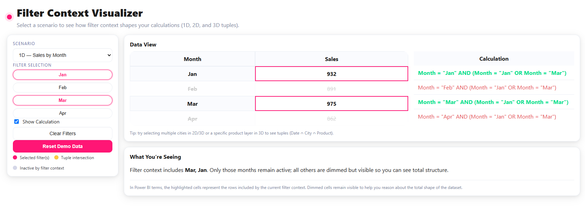
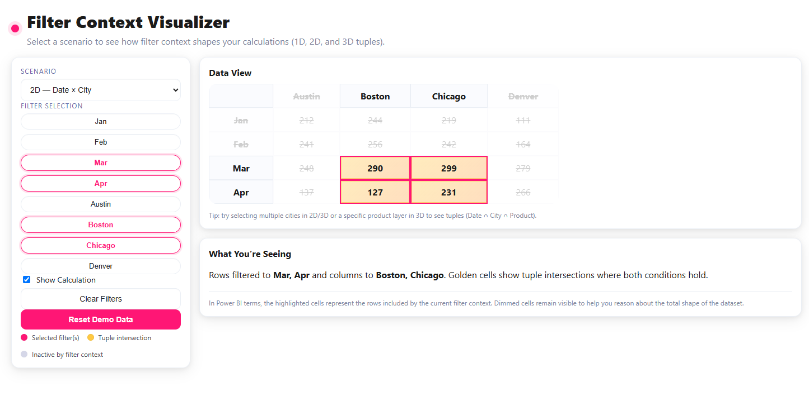
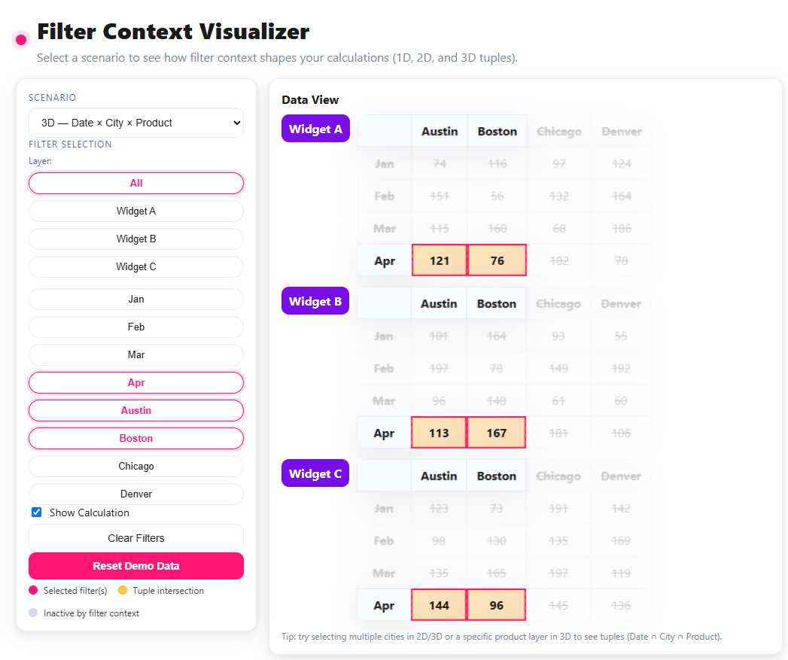
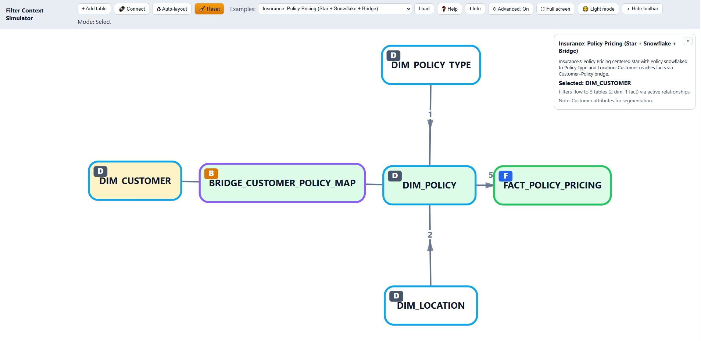
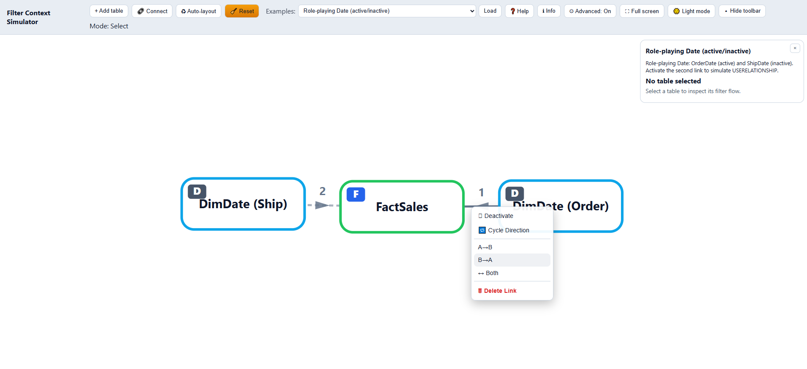

# Power BI Filter Context Simulators

This folder contains two browser‑only simulators:

- `context_simulator_1.html` — a matrix‑based demo of 1D/2D/3D filter context and tuples, great for teaching how filters shape visible data.
- `context_simulator_2.html` — an interactive graph of tables/relationships showing filter flow, directions, activation, and diagnostics (risks, ambiguity, coverage). Includes a right‑click context menu for link operations.

Both are client‑side and run locally with no build step.

## Quick start

### v1 — Matrix demo (`context_simulator_1.html`)
- Open `context_simulator_1.html` in a modern browser (Chrome/Edge/Firefox).
- Pick a scenario (1D/2D/3D) from the dropdown.
- Click pills to add/remove filters. In 3D, choose a product layer.
- Optional: toggle the 1D calculation panel.

### v2 — Graph demo (`context_simulator_2.html`)
- Open `context_simulator_2.html` in a modern browser (Chrome/Edge/Firefox).
- Use the Examples dropdown to load a model, then click a table to see which tables receive its filter (highlighted reach).
- Toggle Advanced mode (⚙) to show measure risk cues in the Info panel.

No build or server required; everything runs locally in the browser.

## Files
- `context_simulator_1.html` — matrix‑based view of data with filters and tuple highlights.
- `context_simulator_2.html` — D3 graph with nodes (tables) and links (relationships), examples, and diagnostics.

## Screenshots

### v1 — Matrix demo
<p align="left">
  <a href="img/ftc1-1d-view.png"></a>
  <a href="img/ftc1-2d-view.png"></a>
  <a href="img/ftc1-3d-view.png"></a>
  
</p>

### v2 — Graph demo
<p align="left">
  <a href="img/ftc2-insurance-bridge.png"></a>
  <a href="img/ftc2-right-click-menu.png"></a>
</p>

---

## About v1 (context_simulator_1.html)

The v1 simulator presents small datasets as HTML tables to illustrate filter context and tuples:

- 1D: Sales by Month (optional calculation table shows per‑row expressions)
- 2D: Date × City (rows = Months, columns = Cities)
- 3D: Date × City × Product (stacked 2D grids, one per Product layer)

Key UI elements
- Filters are represented as pill buttons; selecting multiple pills forms the active context.
- In 2D/3D, highlighted cells represent tuple intersections where all conditions hold.
- A short explanation panel describes the current state and selections.

Interactions (v1)
- Click pills to toggle individual filters.
- Choose a Product layer for 3D or "All" to show every layer.
- Toggle the 1D calculation panel on/off.

## What you can do (v2 graph simulator)
- Add tables, drag to reposition, double‑click to rename.
- Connect tables and cycle relationship direction (A→B, B→A, Both).
- Use a right‑click context menu on links to Activate/Deactivate, Cycle or Set direction (A→B, B→A, Both), or Delete the link.
- Inspect filter reach from the selected table, with per‑selection diagnostics.
- Switch between light/dark themes and optional full‑screen.
- Explore curated example models showing good and problematic patterns.

## UI overview (v2)
- Toolbar buttons:
  - Add table, Connect, Auto‑layout, Reset
  - Help (instructions), Info (model panel), Advanced (On/Off)
  - Full screen toggle, Theme toggle, Hide/Show toolbar
- Canvas:
  - Tables render as nodes with a badge: D (dimension), F (fact), B (bridge)
  - Links render with arrowheads for direction; dashed when inactive
  - Mid‑edge chevron shows direction; numeric labels (1–10) are hotkeys
- Info panel (`updateInfoPanel()`):
  - Example name and description
  - Selected table title, table notes
  - Reachability summary (how many dims/facts are reached)
  - Diagnostics list:
    - Risky/non‑selective relationships (M:M or bidirectional)
    - Ambiguous paths from selection
    - Inactive relationships that would expand reach if activated
  - Measures (Advanced mode): shows measure list with risk hints

## Advanced mode and measure risk cues (v2)
When Advanced mode is ON, measures defined on fact tables are listed with lightweight cues derived from diagnostics:
- DISTINCTCOUNT: ⚠ M:M/↔ risk; ⚠ Ambiguous paths
- AVERAGE: ⚠ Ambiguous paths
- SUM: ℹ Dup risk (on ambiguous paths)

These badges use the same diagnostics the graph computes per selection:
- `nonselectiveSet`: edges flagged as many‑to‑many (`*:*`) or bidirectional (`↔`)
- `ambiguousSet`: edges participating in multiple active paths from the selection

Formatting is simulated via `format` (e.g., `currency`).

## Examples included (v2)
Use the Examples dropdown to load scenarios:
- Regular star
- Snowflake dimension
- Ambiguous snowflake paths
- Redundant path (direct + bridge)
- Multiple facts (shared dims)
- Flattened star with multiple facts
- Bridge table (many-to-many)
- Role-playing Date (active/inactive)
- Bidirectional demo
- FACT grain mismatch (daily vs monthly)
- Many-to-many without bridge (problem)
- Overuse of bidirectional (cross-dim bleed)
- Dual active date relationships (ambiguous)
- Wrong direction in snowflake

Insurance2 dataset scenarios (reflect CSVs in `Module 1/`):
- Insurance: Policy Pricing (Star + Snowflake + Bridge)
- Insurance: Auto Claims (Policy + Vehicle + Customer via Bridge)
- Insurance: Life Claims (Policy + Customer via Bridge)
- Insurance: Exposure Monthly (Customer–Policy coverage)
- Insurance: Full model (all tables)

Each example sets up `nodes` and `links`, and many include notes and measures for richer Info panel content.

## Interactions and shortcuts

### v2 — Graph demo
- Click a table: highlight selection and reachable tables (green outline)
- Connect mode: click source then target to add a relationship
- Click a link, mid symbol, or its number: cycle direction (A→B → B→A → Both)
- Right‑click a link, mid symbol, or its number: open the context menu
  - Activate/Deactivate, Cycle Direction, Set A→B/B→A/Both, Delete Link
- Keys 1–9 (0 for 10): operate on the link with that number (cycle direction)
- Double‑click a table: rename
- Click empty canvas: clear selection

### v1 — Matrix demo
- Click pills to toggle filters (months/cities/products)
- In 3D, select a Product layer or "All" to show every layer
- Optional: Show/Hide 1D calculation panel

## Data model schema (v2, for extending examples)
Nodes (tables):
```js
{
  id: 'D1',            // unique string id
  name: 'DimDate',     // display name
  x: 300, y: 220,      // initial position
  type: 'dim|fact|bridge', // optional; inferred from name/granularity if omitted
  role: 'bridge',      // optional; marks bridge rendering
  notes: ["..."],     // optional array or string
  measures: [          // optional; shown in Advanced mode
    { name: 'Total Sales', agg: 'SUM', format: 'currency' }
  ]
}
```
Links (relationships):
```js
{
  source: 'D1', target: 'F1',
  dir: 'AtoB' | 'BtoA' | 'Both', // filter direction
  active: true,                   // dashed when false
  cardinality: '*:*'              // optional; flags many‑to‑many for diagnostics
}
```
Add or modify examples in `EXAMPLES` inside `context_simulator_2.html`. The loader (`loadExample()`) copies nodes/links and renders the graph.

## How diagnostics work (v2)
- Reachability: respects only currently active links and their filter directions.
- Non‑selective: marks links with cardinality `*:*` or direction `Both` as risky (teaching cue).
- Ambiguity: from the selected table, a target is ambiguous if there are 2+ distinct active paths (depth‑limited search).
- Inactive coverage: simulates activating each inactive link to report newly reachable tables.

## Tech stack

### v1 — Matrix demo
- Single HTML file: `context_simulator_1.html`
- Vanilla HTML/CSS/JS; renders data tables and explanation text

### v2 — Graph demo
- Single HTML file: `context_simulator_2.html`
- D3.js v7 for rendering and interactions
- No external services; all logic is client‑side

## Known limitations
- Educational simulator only; does not interpret DAX or storage engine semantics.
- Ambiguity search is depth‑limited and assumes relatively small graphs.
- Measure badges are heuristic teaching hints, not correctness proofs.

## Development tips
- Toggle theme and advanced mode states persist via `localStorage`.
- Colors, badges, and hatch patterns are theme‑aware using CSS variables.
- To add a new example, extend `EXAMPLES` and add an `<option>` to the Examples dropdown.

## License
Internal/demo use. Add a license if distributing externally.
